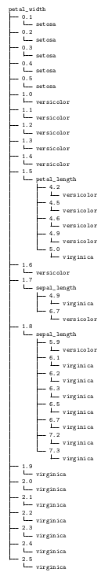

# DecisionTreeLearning
Assioma Andrea Aligi\
13 Gennaio 2022
## 1. Introduzione
Il seguente elaborato mostra la realizzazione di un albero di decisione in grado
di apprendere, e ne analizza l’accuratezza. Quest’ultimo viene costruito tramite
algoritmo ID3, partendo da dati di training e testing.\
\
L’induzione sugli alberi decisionali è un metodo che realizza funzioni discrete
tramite alberi di decisione. Perciò possono essere visti anche come un insieme
di regole se/allora.\
Ogni nodo dell’albero specifica un attributo di una determinata istanza e la
ramificazione che si crea a partire da esso corrisponde a uno dei possibili valori
di quell’attributo. L’algoritmo (ID3) ripete il processo per ogni sottoalbero che
si viene a creare, che ha come radice il nodo successivo.
Per decidere quale attributo inserire prima all’interno dell’albero si introducono
i concetti di entropia e di _information gain_.\
L’entropia è un concetto che va applicato ai valori di un attributo, e indica
quanto è ”d’impedimento un valore a livello di chiarezza/ univocità nella realizzazione di una funzione discreta”: infatti, maggiore è l’entropia, minore è
la chiarezza del valore. A livello numerico può essere interpretato nel seguente
modo:
\
dove $S$ è  un insieme che contiene una serie di target $c$ relativi al valore, mentre $p(i)$ rappresentano le porzioni di ciascun target $c$ presenti in $S$.\
L'_information gain_, invce, rappresenta l'entropia generata da un determinato attributo.\
Più precisamente è dato da:
\
Dove $values(A)$ sono tutti i valori possibili che può assumere $A$ e $S_v$ è un sottoinsieme di $S$ che contiene i target dei valori $v$ di $A$.\
\
L’induzione su alberi di decisione rappresenta il miglior approccio per una serie
di problemi, tra cui quelli con le seguenti caratteristiche:
* **Le istanze sono rappresentate da coppie di valori di attrbuti**: le
istanze sono caratterizzate da un insieme di attributi con i loro rispettivi
valori. La situazione ideale per l’albero sarebbe quella in cui ogni attributo
possiede una ristretta varietà di valori possibili, disgiunti (non correlati)
tra loro.
* **La formazione di dati può non avere valori all’interno degli attributi**: questi alberi possono essere adoperati anche quando un attributo
ha valori sconosciuti.
### 1.1 Hardware e Sistema operativo utilizzati
Le piattaforme sui cui verrano effettuati gli esperimenti sono:
* Un pc fisso con processore i5-10600k e 16gb di ram. Il sistema operativo
adoperato è Ubuntu 20.04.
* Un portatile con processore M1 e 8 gb di ram. Il sistema operativo adop-
erato è OS Monterey.
<!---->
Non in tutti gli esperimenti sono stati usati entrambi.
## 2. Creazione albero di decisione
Per realizzare un albero di decisione, inizialmente si crea un dataset di attributi
A (il quale servirà come training data), incluso quello obiettivo S. Quest’ultimo
è stato trasformato in ”lista di liste”, tramite una funzione apposita della libreria pandas, che estrae i dati da un file excel.\
Successivamente, si adopera l’algoritmo ID3 per cortruire l’albero: determinati
gli information gain di tutti gli attributi, pone il maggiore tra i risultati come
radice dell’albero, in quanto ”predice” nel miglior modo l’attributo obiettivo.
Nelle successive iterazioni si dovrà dividere il dataset in ”sotto-tabelle”, (creando
un nodo per ciascuna) ordinati in base ai valori dell’attributo con information
gain più grande, a cui verrà applicato lo stesso algoritmo. Il processo si inter-
rompe quando ogni attributo è stato inserito oppure tutte le entropie dei valori
degli attributi sono nulle (incluse quelle i cui valori non hanno più relazioni con
l’attributo target).\
Come dataset si adopera quello della pianta Iris e quello di ”PlayTennis”(di cui
verrà mostrato solo l’albero di decisione). Gli attributi dei due dataset sono, per
l’Iris, largezza e lunghezza sepali, larghezza e lunghezza petali, e specie di Iris
(che rappresenta l’attributo obiettivo). Per ”PlayTennis” sono invece meteo,
temperatura, umidità, vento e PlayTennis.\
Nel programma sono state realizzate due classi:
* __Node__ inizializza i nodi dell’albero di decisione. I suoi attributi sono:
    * _type_ indica se il nodo sia tale oppure una foglia.
    * _attribute_ associa al nodo il tipo di attributo (e quindi lunghezza/
larghezza sepalo, oppure lunghezza/ larghezza petalo; in caso si tratti
di una foglia, attribute assume direttamente il valore dell’attributo
obiettivo).
    * _children_ contiene le sotto-tabelle nella forma di ”liste di liste”.
<!---->
(__Nota__: nel momento in viene instanziato un suo oggetto, gli attributi sono
inizializzati tutti a None)
* __DecisionTree__ realizza l’effettivo albero di decisione. Questa classe presenta quattro metodi e un solo attributo root (il quale punta al primo
nodo inserito nell’albero):
    * _entropy()_ calcola l’entropia dell’attributo target S di una tabella/
sotto-tabella dato in input. Come output ritorna il risultato del cal-
colo dell’entropia.
    * _gain()_ calcola l’_information gain_ prendendo in input l’attributo
di una determinata tabella/sotto-tabella. Come output ritorna il
risultato di tale operazione e i valori dell’attributo (i quali saranno
utili per la funzione _maxGain()_).
    * _maxGain()_ determina quale attributo ha information gain più alto
e genera le sotto-tabelle divise in base ai valori di quest’ultimo (rimuovendoli in un passaggio successivo). Il tutto viene ritornato in output
(stotto-tabelle e valori), insieme all’attributo (che per comodità è
un valore numerico, invece che essere ad esempio lunghezza sepalo,
larghezza petalo, ...). Come input prende solamente il dataset.
    * _recursiveInsertion()_ costruisce l’albero di decisione in modo ricorsivo a partire da un nodo (che sarà, inizialmente, quello radice)
e un dataset dati in input. Per ciascun nodo nuovo inserito tramite
istanziazione di un oggetto di Node, viene settato l’attributo _.type_,
insieme a _.attribute_, _.branches_ e _.children_, in base al valore
di gain determinato dal precedente metodo. In caso la condizione
non fosse verifcata, i valori del nodo rimarrebbero quelli di default
(impostati dal costruttore di Node): ci si troverebbe, quindi, nella
situazione in cui l’attributo ha valori sconosciuti.
### 2.1 Verifica accuratezza albero
Per verificare l’accuratezza dell’albero, si adopera un secondo dataset, è cioè
il test data, che ha le stesse proprietà del training data. Ogni sua riga viene
comparata con l’albero decisionale e viene accertato se quest’ultimo predice o
meno in modo corretto il valore dell’attributo obiettivo.\
Perciò, si definisce un nuovo metodo a parte (_accuracy()_):
* permette di scorrere nell’albero di decisione in base ai dati della riga del
test data dato in input.
* come input prende i due parametri sopra citati, come output, invece, ritorna vero se la foglia e il valore dell’attributo obiettivo del test data coincidono. Altrimenti, se non si hanno informazioni oppure non coincidono,
ritorna falso.
<!---->
Per ricavare l’accuratezza da tale algoritmo, vengono contati quanti true sono
stati generati rispetto alla quantità di righe del test data, esprimendo il risultato
in percentuale.
## 3. Analisi dei risultati
\
\
**Nota**:per la struttura grafica è stata usata una libreria esterna, e cioè treelib.\
\
Nel caso dell’Iris, con tabelle training e testing di 87 e 63 righe, l’accuratezza
è risultata: 0.873015873015873 = 87%.\
Con uno split 60/40 si è ottenuto un albero con buona accuratezza, la quale può
essere migliorata se vengono aggiunti, ovviamente, ulteriori dati.